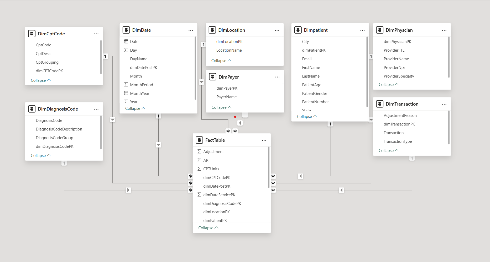
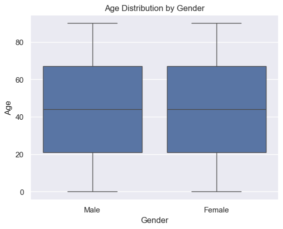
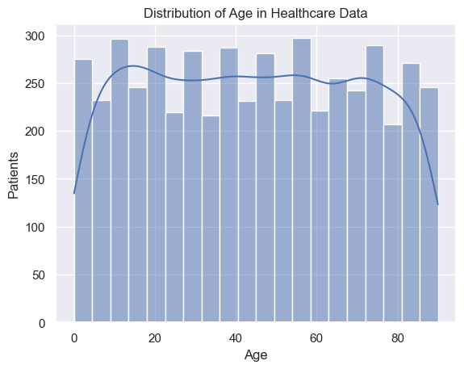
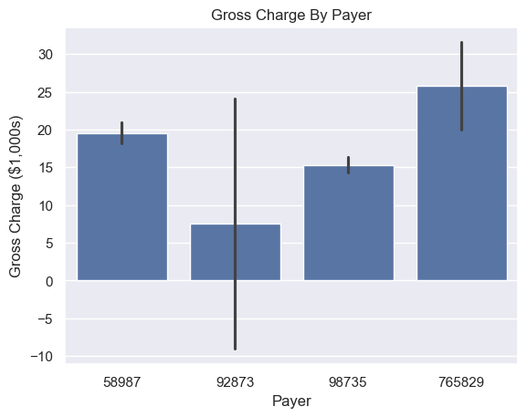

# Final Career Simulation

## Summary of Project

The final career simulation emcompasses the data analytics techniques learned in the course. It begins with real-world data: a healthcare dataset downloaded from [here](https://www.kaggle.com/datasets/tomaslui/healthcare-dataset). The dataset is very well-structured with a data dictionary, but it certainly takes some time to parse through.

The data was downloaded, imported into SQL tables, and then loaded into PowerBI, ensuring the schema was correct (the data naturally utilizes a star schema). Here is a screenshot of the schema diagram, from PowerBI:

After a number of SQL queries based on cleaning and aggregating the data (found [here](./SQL/queries.sql)) the data was exported as-is for loading into Python. The first Python file created was the `load_data.py` file, which is really only a class that loads the data and runs itself (to be imported by the `visuals.py` file). Each table was read directly from CSV into a [Pandas dataframe](https://pandas.pydata.org/docs/reference/api/pandas.DataFrame.html#pandas.DataFrame). These dataframes were aggregated into one "dataframe dictionary" such that each individual dataframe could be indexed by name. *Note: I am not sure this is the best way to deal with larger datasets in Python, namely making a dictionary of pandas dataframes, but this was the approach I settled on.* An individual dataframe can be called in the Python code as `df_dict['table_name']`.

After the data structuring in Python was complete, visuals were rendered. These were done using the `seaborn` library (which makes use of `matplotlib`). The following visuals are directly output from Python:

Because Charge by Payer's x-axis is the Payer code rather than the Payer name, I have included the table to match the codes to the names for readability:

| Payer Code | Payer Name |
| ---------- | ---------- |
| 58987      | Commercial |
| 92873      | Other      |
| 98735      | Medicare   |
| 765829     | Medicaid   |

There are several payments categorized as "Other" payments that are negative. It is unclear what this means. Perhaps it was a self-pay patient that later got some of the bills covered by insurance, so it shows up on the hospital's books as negative payments. It's also possible some patients paid for surgeries up-front and the invoice was less than the initial payment, so the hospital reimbursed them. With "data in the wild" like this, we can only speculate.

Resuming discussion of the workflow, the attention turned to the PowerBI visuals. Map visuals are far easier to process in PowerBI than in Python, so on the first tab is the US gradient map of patient age, from green (young) to red(old). Keep in mind only 18 states are repesented in the data, so the rest of the country is gray. An accompanying table gives easy readability, and the map also features hover-over dynamic data display.

The second PowerBI tab is "Patient Age and Gross Charge". The scatterplot plots the two variables featured in the tab. No linear regression was performed because it is clear from the scatterplot the relationship has virtually no slope. Hospital charge is not dependent upon patient age (a confirmation of the null hypothesis).

In this same tab is the table that details the average age of patients grouped by payer and gender. This allowed insight into demographics of the insureds. Other (probably self-pay) males are the youngest (because they likely percieve themselves the healthiest and are not insured) and Medicare males are the oldest, on average.

The last PowerBI tab is a detailed brakdown of what insurance companies are being billed for, split between men and wome. The gender difference is likely not statistically significant here (a t-test could confirm, add this to the "steps fo further inquiry" category) but it has been partitioned for scrutiny all the same. Clearly, surgeries and Level II codes (prosthetics, wheelchairs, and large medical equipment) are the most expensive for both genders, followed by the actual hospital boarding bill. Males pay quite a bit more for PathLab (pathology services), for reasons not easily discernible or inferentiable from the data.

## Methodology

The basic workflow was as such:

- Download data as CSV files
- Load flat files into SQL Server, being careful with primary keys (referring to the accomanying data dictionary)
- Performing joins and quick aggregations in SQL to prepare the data for PowerBI export ([here](./SQL/queries.sql))
- Load data into PowerBI and ensure the schema was correct and tables matched on the correct column
- Load some visuals (such as map visuals) in PowerBI that fit a use-case that is much more effort-demanding in Python
- Load flat files into Python as Pandas dataframes
- Perform some basic visualization tasks on the dataframes using `seaborn` and `matplotlib` libraries

## Targets

The predicted target was to have an all-encompassing grasp of the healthcare system, which was not exactly achieved for a number of reasons. Firstly, there is a brilliant "line-itemization" of the data in the `FactTable.csv` but it is so robust it would take time far beyond the scope of the project to parse through. My targets quickly became: isolate age, gender, and insurance (payer) type as strata and create visuals splitting data or correlating data along those lines. This led to a lot of SQL joins, which can be seen in the SQL file. The workflow proceeded out from there, and I got to incorporate a bit of my favorite and by far my most experienced language of Python. The target I set for myself was actually *not* to do the whole thing in Python (back in the day I would have `urllib3`ed all the data, or scraped it with `beautifulsoup4`, loaded it into Pandas, exported it to a database but accessed the database directly with `pymysql` and not bothered with PowerBI or SQL Server Studio) and, in doing so, I learned a lot about incorporating different workflows and trying to integrate them into one project.
